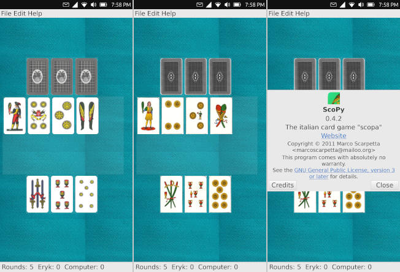

# ScoPy4UT

This project will install ScoPy into a Libertine container on an Ubuntu Touch phone. 

It's a bit of a hack, but if you enjoy playing Scopa (Italian card game), then you know how important it is to have this game on your phone.  So until we can create a proper app, I have adapted Marco Scarpetta's ScoPy to run in a Libertine container.

The original program was for a computer desktop.  It was written back in 2011.  To get it to work on my phone, I had to resize the images of the playing cards.  So (unless you have a Google Pixel 3a) to get it to work on your phone, you will also have to resize the images of the playing cards.  Sorry!

My contribution is a rearrangement of the card table -- from horizontal (for desktop) to vertical (for phone) -- so that you can play Scopa on an Ubuntu Touch phone.

Have fun!  I hope you enjoy the game!
